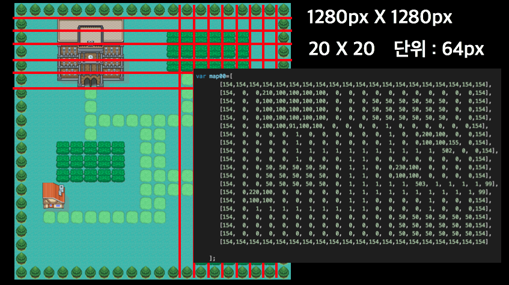
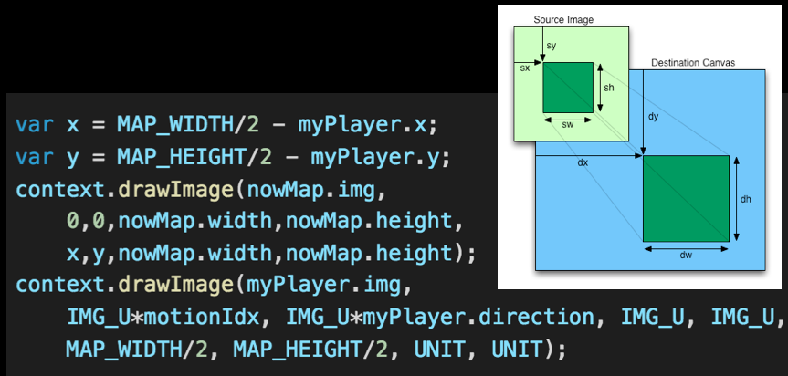
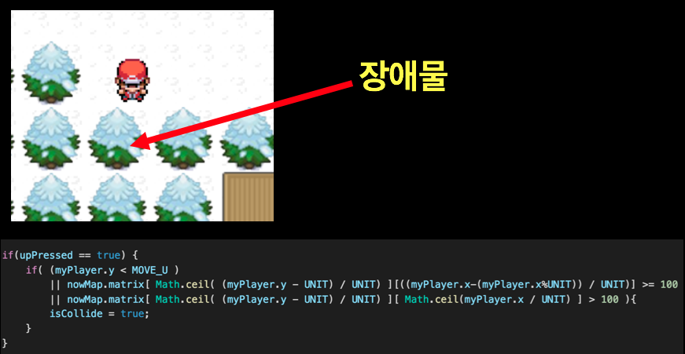
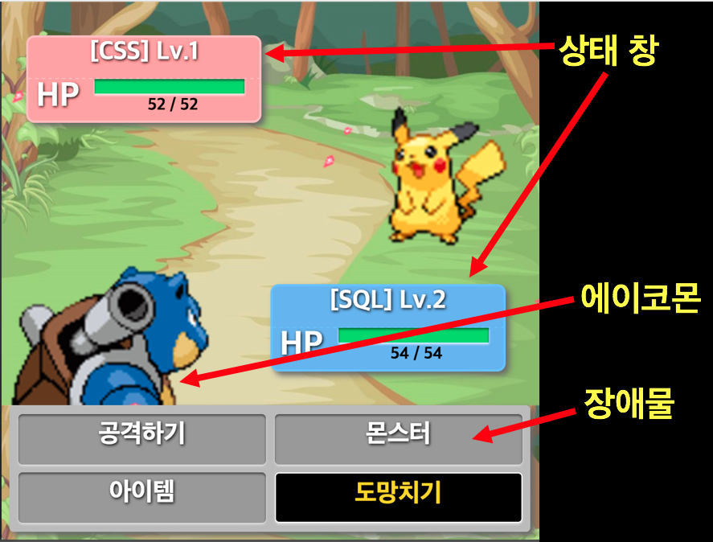

# Acomon

mini project : Homepage for Pokemon

## 1. 개요

- **HTML5 + (Canvas)**를 활용하여 RPG게임을 개발한다.
- 2D 게임의 향수를 불러일으키는 동시에 프로그래밍 지식을 최대로 활용하는 것을 목적으로 한다.

## 2. 실행

`[AllForOne]-[index.html]`

> 대화 및 퀘스트는 [1], [2] 등 숫자를 통해 선택한다.
> 이동은 방향키로 한다.
> 아무거나 누르면 잘 안될 수도 있다. 새로고침을 하도록하자.

## 3. 기술에 대해여

### 3-1. 맵 그리기

64px을 단위로 20X20(1280px X 1280px)크기의 맵을 구성한다.

NPC는 특정 위치에 고정되며 맵 이동시 주인공은 중앙에 위치한다.

먼저 맵을 그린 후 그 위에 캐릭터를 중앙에 그린다.

위치에 저장된 값을 이용하여 충돌을 감지한다.

NPC와 대화할 때는 키보드를 이용한다.

## 3-2. 전투

전투는 전투화면으로 변환하여 진행한다.

전투지역에 들어가면 자동으로 전투가 시작된다.
